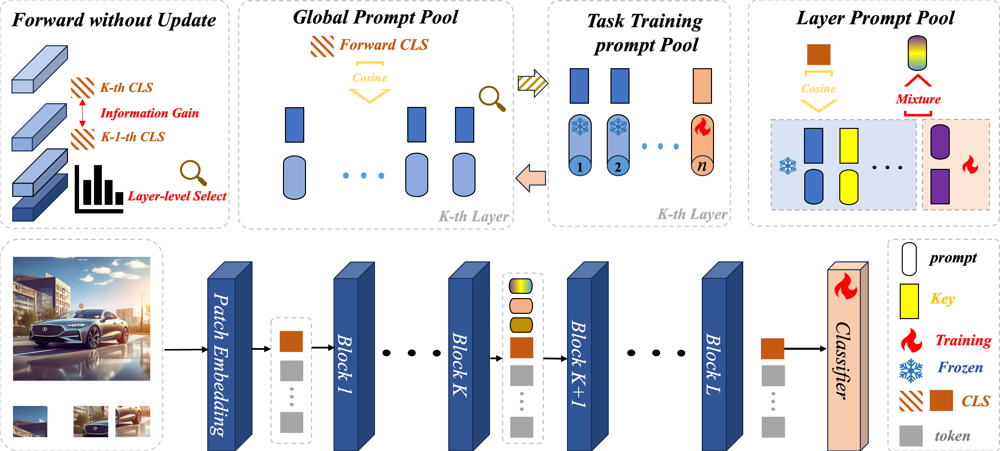

# LDEPrompt: Layer-importance guided Dual Expandable Prompt Pool for Pre-trained Model-based Class-Incremental Learning
Prompt-based class-incremental learning methods typically construct a prompt pool consisting of multiple trainable keyprompts and perform instance-level matching to select the most suitable prompt embeddings, which has shown promising results. However, existing approaches face several limitations, including fixed prompt pools, manual selection of prompt embeddings, and strong reliance on the pretrained backbone for prompt selection. To address these issues, we propose a Layer-importance guided Dual Expandable Prompt Pool (LDEPrompt), which enables adaptive layer selection as well as dynamic freezing and expansion of the prompt pool. Extensive experiments on widely used classincremental learning benchmarks demonstrate that LDEPrompt achieves state-of-the-art performance, validating its effectiveness and scalability.


### Dataset
We provide the processed datasets as follows:
- **CIFAR100**: will be automatically downloaded by the code.
- **CUB200**:  Google Drive: [link](https://drive.google.com/file/d/1XbUpnWpJPnItt5zQ6sHJnsjPncnNLvWb/view?usp=sharing) or Onedrive: [link](https://entuedu-my.sharepoint.com/:u:/g/personal/n2207876b_e_ntu_edu_sg/EVV4pT9VJ9pBrVs2x0lcwd0BlVQCtSrdbLVfhuajMry-lA?e=L6Wjsc)
- **VTAB**: Google Drive: [link](https://drive.google.com/file/d/1xUiwlnx4k0oDhYi26KL5KwrCAya-mvJ_/view?usp=sharing) or Onedrive: [link](https://entuedu-my.sharepoint.com/:u:/g/personal/n2207876b_e_ntu_edu_sg/EQyTP1nOIH5PrfhXtpPgKQ8BlEFW2Erda1t7Kdi3Al-ePw?e=Yt4RnV)

You need to modify the path of the datasets in `./utils/data.py`  according to your own path.


## Running scripts

Please follow the settings in the `exps` folder to prepare json files, and then run:

```
python main.py --config ./exps/[datasets]/[filename].json
```

**Here is an example of how to run the code** 

if you want to run the cifar dataset using ViT-B/16-IN1K, you can follow the script: 
```
python main.py --config ./exps/cifar/lieprompt.json
```

if you want to run the cifar dataset using ViT-B/16-IN21K, you can follow the script: 
```
python main.py --config ./exps/cifar/lieprompt_in21k.json
```


## Acknowledgment

We would like to express our gratitude to the following repositories for offering valuable components and functions that contributed to our work.

- [PILOT: A Pre-Trained Model-Based Continual Learning Toolbox](https://github.com/sun-hailong/LAMDA-PILOT)